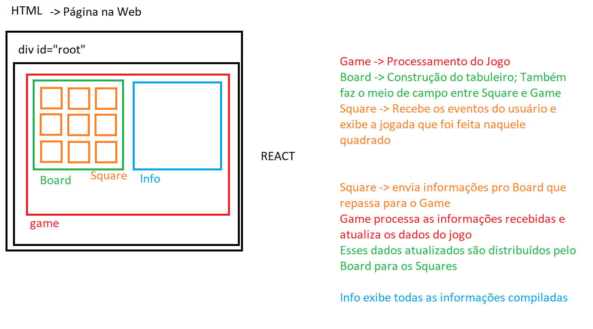

JavaScript -> Sites na Web, páginas, etc

Navegador -> Interpreta códigos JS
Navegador, como o Chrome, possui um motor de interpretação

Node é escrito em C++, e é feito para interpretar código JS e executar isso via C++

Geralmente JS era usado apenas para MANIPULAR O DOM

Documento da Web, página da web = dom

String nome = "Paulo";

val nome: String = "Paulo";

string nome = "Paulo";

nome = "Paulo"

JavaScript no Chrome, executado no navegador do usuário

JavaScript no Node, executado direto no servidor

Recebe uma requisição do frontend, executa um código secreto e devolve apenas o resultado

Esse resultado são dados que o frontend recebe e transforma em informação visual para o usuário

# Criar projeto:
`npx create-react-app nome_projeto_tudo_minusculo`

# Rodar projeto:
`npm start`

# Diagrama da Aplicação

